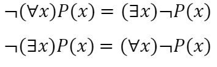
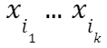
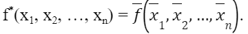
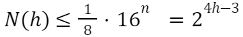

[назад](../../../pi/pi-1-1.md#Дискретная-математика)
***
Авторы (БДСМ – party):
+ https://www.twitch.tv/parklegaming
+ https://www.instagram.com/lee_gzu/
+ https://www.instagram.com/unknw.name/
+ https://www.instagram.com/xk3ka/

<h3>Билеты:</h3>

1. [Комбинаторные числа: Cnk, Ank, Pn, n!, n - мерный куб](#q-1) 
2. [Метод математической индукции](#q-2)
3. [Рекуррентные формулы. Числа Фибоначчи](#q-3)
4. [Множества и операции с ними: объединение, пересечение, степень](#q-4)
5. [Отношения и их свойства. Отношение эквивалентности](#q-5)
6. [Частично упорядоченные множества (ЧУМ). Примеры](#q-6)
7. [Линейный порядок. Цепи и антицепи. Теорема Дилуорса (формулировка)](#q-7)
8. [Высказывания и операции над ними. Свойства системы A0 = {∧, ∨, ¬}](#q-8)
9. [Функции как отношения; предикаты как логические функции](#q-9)
10. [Использование кванторов в предикатах. Отрицание формулы с кванторами](#q-10)
11. [Булевы функции. Количество булевых функций от n переменных](#q-11)
12. [Представление булевых функций совершенными ДНФ](#q-12)
13. [Представление булевых функций совершенными КНФ](#q-13)
14. [Полиномы Жегалкина](#q-14)
15. [Полнота и замкнутость системы булевых функций](#q-15)
16. [Определения основных замкнутых классов T0, T1, S, M, L](#q-16)
17. [Теорема о несовпадении основных замкнутых классов](#q-17)
18. [Теорема о функциональной полноте. Схема доказательства](#q-18)
19. [Лемма о построении констант на основе свойств T0, T1, S](#q-19)
20. [Лемма о построении отрицания на основе свойств M](#q-20)
21. [Лемма о построении конъюнкции на основе свойств L](#q-21)
22. [Схемы функциональных элементов. Связь с булевыми функциями](#q-22)
23. [Методы синтеза схем функциональных элементов](#q-23)
24. [Функции Шеннона и их оценки](#q-24)
25. [Графы: вершины, ребра, инцидентность. Изображение и изоморфизм графов](#q-25)
26. [Подразделение графа, подграф, гомеоморфизм графов. Планарность графа](#q-26)
27. [Пути, циклы, петли на графе. Связность графа и степени его вершин](#q-27)
28. [Оценка числа графов с заданным количеством ребер](#q-28)
29. [Дерево. Эквивалентность двух определений](#q-29)	
30. [Оценка числа деревьев с заданным количеством ребер](#q-30)
31. [Двухполюсные сети. Суперпозиция сетей. П – сети](#q-31)
32. [Оценка числа ребер «густого» дерева и числа П – сетей](#q-32)
33. [Формула Эйлера для плоских графов и ее следствия](#q-33)
34. [Теорема о пяти красках для плоских графов](#q-34)
35. [Основные понятия теории кодирования: алфавит, слово, сообщение, схема кодирования, декодирование](#q-35)
36. [Однозначность префиксных кодов. Обращенная схема кодирования](#q-36)
37. [Неравенство Крафта – Макмиллана для однозначных кодов](#q-37)
38. [Теорема об «улучшении» однозначного кода.](#q-38)
39. [Префиксные коды и деревья. Способы уменьшения избыточности кода](#q-39)
40. [Существование оптимальных кодов (кодов с минимальной избыточностью)](#q-40)
41. [Метод Хаффмана построения оптимального кода](#q-41)
42. [Самокорректирующиеся коды. Простейшие идеи построения](#q-42)
43. [Коды Хемминга, исправляющие одну ошибку](#q-43)
44. [Расстояние (метрика) на множестве En](#q-44)

***

<a name="q-1"><h2> 1. Комбинаторные числа: Cnk, Ank, Pn, n!, n - мерный куб </h2></a>
+ Cnk – число сочетаний из n по k, т.е. количество способов, которыми можно выбрать k элементов из n – элементного множества (k ⩽ n)
  + Cnk = n!/(k!(n - k)!)
+ Ank – упорядоченные размещения – это количество способов, которыми можно упорядочить k элементов из n – элементного множества (k ⩽ n)
  + Ank = n!/(n - k)! 
+ Pn – количество способов, которыми можно упорядочить n элементов (n ⩾ 1)
  + Pn = n!
+ n! – произведение всех натуральных чисел до n, включая n

5! = 1 * 2 * 3 * 4 * 5 = 120

n - ***мерный куб*** – это фигура, каждая вершина которой связана рёбрами с n другими вершинами; n, в свою очередь, определяет размерность этой фигуры
n-мерный куб над множеством M – множество упорядоченных наборов

13:00 среда
4 – мерный куб – тессеракт
5 – мерный куб – пентеракт
6 – мерный куб – хексеракт

[К билетам](#Билеты)
***

<a name="q-2"><h2>2. Метод математической индукции </h2></a>
Метод математической индукции (ММИ) позволяет доказывать некоторые утверждения о натуральных числах

ММИ состоит из 2х шагов:
1. Основание индукции (проверим справедливость утверждения при n = 1)
2. Общий шаг (предполагая, что утверждение справедливо при n = k, проверим его справедливость при n = k + 1)

Например:

Докажем утверждение: 12 + 22 + 32 + … + n2 = nn + 12n + 16 с помощью ММИ 

 – утверждение верно, чтд

[К билетам](#Билеты)
***

<a name="q-3"><h2>3. Рекуррентные формулы. Числа Фибоначчи </h2></a>
***Рекуррентная формула*** – формула, которая определяет каждый член последовательности an как функцию от p предыдущих членов и возможно номера члена последовательности 

Xn+1=Xn+Xn-1

***Рекуррентное соотношение*** – это уравнение, которое рекурсивно определяет последовательность или многомерный массив значений, если задан один или несколько начальных членов

***Числа Фибоначчи*** – элементы числовой последовательности в которой первые два числа равны двум единицам, а каждое последующее число равно сумме двух предыдущих чисел

Последовательность чисел Фибоначчи задается следующим рекуррентным соотношением:

F0 = 1, F1 = 1, Fn = Fn – 1 + Fn – 2, n ⩾ 2, n ∈ Z

Также n – ый член последовательности чисел Фибоначчи можно найти с помощью следующей формулы Бине:

[К билетам](#Билеты)
***

<a name="q-4"><h2>4. Множества и операции с ними: объединение, пересечение, степень </h2></a>
***Множество*** – объединение в единое целое определенных различных объектов, которые называются элементами множества Множество, не содержащее ни одного элемента, называется пустым множеством

Множество, содержащее все объекты и все множества, называется универсальным множеством – U

Операции над множествами:

A – множество, a – элемент множества A;
1. Объединение (∪) | A ∪ B = C

   Определение – C = {c | c ∈ A или c ∈ B}

2. Пересечение (⋂) | A ⋂ B = C

   Определение – C = {c | c ∈ A и c ∈ B}

***Степень множества*** (булеан) – множество всех подмножеств данного множества A, обозначается P(A) или 2A

1. Дополнение до универсального множества (A)

    Определение – A = {a | a ∉ A}
2. Разность (\) | A \ B = C

    Определение – C = {c | c ∈ A и c ∉ B}
3. Симметрическая разность () | A  B = C

    Определение – C = {c | (c ∈ A и c ∉ B) или (c ∈ B и c ∉ A) }
4. 
Объединение, пересечение, разность и симметрическая разность – *бинарные  операции*

Дополнение до универсального множества – *унарная*(одно входящее значение)

[К билетам](#Билеты)
***
<a name="q-5"><h2>5. Отношения и их свойства. Отношение эквивалентности </h2></a>
***Бинарным отношением R из множества A в множество B*** называется подмножество прямого произведения A и B и обозначается: R ⊂ A × B

Отношение R на множестве A является:
1. рефлексивным – если для любого x ∈ A справедливо x R x

    A=A
2. симметричным – если для любых x, y ∈ A справедливо x R y –> y R x

    A=B значит, что B=A
3. антисимметричным – если для любых x, y ∈ A справедливо (x R y и y R x) –> (x = y)

4. транзитивным – если для любых x, y, z ∈ A справедливо (x R y и y R z) –> x R z

    A=B, B=C следовательно A=C

Бинарное отношение R на множестве X называется ***отношением эквивалентности***, если оно обладает свойством рефлексивности, симметричности и транзитивности

_Примеры свойств_:
1. свойством рефлексивности обладают:
   + отношение равенства
   + отношение подобия геометрических фигур
   + отношение сравнимости по модулю
2. свойством симметричности обладают:
   + отношение равномощности множеств
   + отношение параллельности прямых и плоскостей
   + отношение равенства
3. свойством антисимметричности обладают:
   + отношение делимости на натуральных числах 
   + отношение равенства
+отношение неравенства (⩽, ⩾ и т. д.)
4. свойством транзитивности обладают:
   + отношение равенства
   + отношение эквивалентности
   + отношение параллельности
   
Примеры отношений эквивалентности:
   1. отношение подобия фигур на плоскости
   2. отношение равенства
   3. отношение связности вершин в графе

[К билетам](#Билеты)
***

<a name="q-6"><h2>6.  Частично упорядоченные множества (ЧУМ). Примеры </h2></a>
***Частично упорядоченное множество*** (ЧУМ) – множество, на котором введено отношение частичного порядка

Бинарное отношение R на множестве X называется ***отношение частичного порядка***, если оно обладает свойством рефлексивности, антисимметричности и транзитивности. Отношения частичного порядка также называют нестрогим порядком

Примеры частично упорядоченных множеств:
1. Множество вещественных чисел R по отношению «меньше либо равно»
2. Множество натуральных чисел N по отношению делимости m | n
3. Множество рациональных чисел Q по отношению «меньше либо равно»

[К билетам](#Билеты)
***

<a name="q-7"><h2>7. Линейный порядок. Цепи и антицепи. Теорема Дилуорса (формулировка)</h2></a>
Линейным порядком на множестве A называется частичный порядок L при котором можно сравнить любую пару элементов, т. е. для любых x, y ∈ A справедливо (x L y) или (y L x)

Рассмотрим некоторое множество A с введенным на нем частичным порядком. Множество C ⊆ A называется цепью, если все элементы C попарно сравнимы. В любой конечной цепи найдется и наименьший, и наибольший элемент

<u>Цепь в ЧУМ это - мн-во, в котором любые 2 элемента принадлежат R

Антицепь – никакие 2 элемента не принадлежат R </u>

Множество C(с загогулиной сверху) ⊆ A называется антицепью, если все элементы C(с загогулиной) попарно не сравнимы. Мощность максимальной антицепи в этом множестве A называют шириной конечного частично упорядоченного множества

**Теорема Дилуорса**:

Минимальное число цепей, на которые можно разбить конечное частично упорядоченное множество, равно ширине этого множества

[К билетам](#Билеты)
***

<a name="q-8"><h2>8. Высказывания и операции над ними. Свойства системы A0 = {∧, ∨, ¬} </h2></a>
Под высказыванием понимают грамматически правильное повествовательное предложение, про которое можно сказать, что оно либо истинно, либо ложно

Операции над высказываниями:
1. Отрицание
2. Дизъюнкция
3. Конъюнкция
4. Импликация
5. Эквивалентность

Примеры высказываний:
1. Отрицание: «На улице не идет дождь»
2. Дизъюнкция: «На улице не идет дождь или над моей головой раскрыт зонтик»
3. Конъюнкция: «На улице идет дождь и над моей головой не раскрыт зонтик»
4. Импликация: «Если на улице идет дождь, то над моей головой раскрыт зонтик»
5. Эквивалентность: «Над моей головой раскрыт зонтик тогда и только тогда, когда на улице идет дождь»

Система A0 = {∧, ∨, ¬} является полной системой булевых функций, т. к. с помощью представленных в ней логических операций можно выразить любую другую логическую операцию (данная система не содержится целиком ни в одном из классов Поста)

[К билетам](#Билеты)
***
<a name="q-9"><h2>9. Функции как отношения; предикаты как логические функции</h2></a>
***Функциональное отношение*** – это такое бинарное отношение между двумя множествами, при котором каждому элементу первого множества может соответствовать не больше одного элемента второго множества

**Определение**.
Пусть даны 2 множества X и Y, и между ними определено бинарное отношение R. Тогда R называется функциональным, если:

Если функциональное отношение полно слева, то оно называется полной функцией

Например: отношение «является квадратным корнем» – полная функция на множестве натуральных чисел

Если функциональное отношение не полно слева, то оно называется частичной функцией

_Например_: отношение «является полным квадратом» – частичная функция на множестве натуральных чисел

***Предикат*** – утверждение, которое содержит переменные, принимающие значения истинно или ложно в зависимости от значений переменных

Множество, на котором предикат принимает только истинные значения, называется множеством истинности предиката

Предикат называется _тождественно – истинным_, если на любом наборе аргументов он принимает истинное значение: P(x1, x2, …, xn) = 1

Предикат называется _тождественно – ложным_, если на любом наборе аргументов он принимает ложное значение: P(x1, x2, …, xn) = 0

Предикат называется _выполнимым_, если хотя бы на одном наборе аргументов он принимает истинное значение

Т.к. предикаты могут принимать только два значения, то к ним можно применять все операции алгебры логики

[К билетам](#Билеты)
***

<a name="q-10"><h2>10. Использование кванторов в предикатах. Отрицание формулы с кванторами</h2></a>
***Кванторы*** – логические операции, которые ограничивают область истинности предиката и создают высказывание

Примеры кванторов:
1. квантор всеобщности (∀x) – выражение «для всех x» («для любого x»)
2. квантор существования (∃x) - выражение «существует x такое, что ...»

***Предикат*** – утверждение, содержащее переменные, принимающие значение истинно или ложно в зависимости от значений переменных

Множество, на котором предикат принимает только истинные значения, называется множеством истинности предиката

Для построения отрицания высказываний, которые содержат кванторы, применяется правило отрицания кванторов:

[К билетам](#Билеты)
***

<a name="q-11"><h2>11. Булевы функции. Количество булевых функций от n переменных</h2></a>
***Булевской функцией*** (БФ) от n переменных называется закон, по которому каждому набору (x1, x2, …, xn), xk ∈ E ставится в соответствие некоторое значение из того же множества E

Обозначение БФ: y = f(x1, x2, …, xn)

Множество всех БФ обозначают обычно через P2. Если речь идет о булевских функциях только от n переменных, то говорят о множестве P2(n)

Две БФ от n переменных (x1, x2, …, xn), считают различными, если хотя бы на одном наборе этих переменных значения функций различаются, и совпадающими, если на любых наборах (x1, x2, …, xn), обсуждаемые функции принимают одинаковые значения. Формально различные (например, заданные разными способами), но совпадающие функции называют еще равносильными или эквивалентными. Для обозначения равносильности функций f и g обычно используют обозначение f ~ g

**<u>Теорема</u>**
Количество различных булевских функций от n переменных равно 

[К билетам](#Билеты)
***
<a name="q-12"><h2>12. Представление булевых функций совершенными ДНФ</h2></a>
Любая БФ f(x1, x2, …, xn) от n переменных, отличная от тождественно нулевой функции, представима в виде совершенной ДНФ, зависящей от тех же переменных x1, x2, …, xn

***ДНФ*** – нормальная форма, в которой булева функция имеет вид дизъюнкции нескольких простых конъюнктов

**Теорема** Для любой булевой функции f(x) не равной тождественному нулю, существует СДНФ, ее задающая

Алгоритм построения:
1. В таблице истинности отмечаем те наборы переменных, на которых значение функции равно 1
2. Для каждого отмеченного набора записываем конъюнкцию всех переменных по следующему правилу: если значение некоторой переменной есть 1, то в конъюнкцию включаем саму переменную, иначе ее отрицание
3. Все полученные конъюнкции связываем операциями дизъюнкции
***
*(x1 ∧ x2 ∧ x3) ∨ …

СДНФ = 1

[К билетам](#Билеты)
***
<a name="q-13"><h2>13. Представление булевых функций совершенными КНФ</h2></a>
***КНФ*** – нормальная форма, в которой булева функция имеет вид конъюнкции нескольких простых дизъюнктов

***СКНФ*** – это такая КНФ, которая удовлетворяет условиям: в ней нет одинаковых простых дизъюнкций; каждая простая дизъюнкция полная

**Теорема** Для любой булевой функции f(x), не равной тождественной единице, существует СКНФ, ее задающая

Алгоритм построения:
1. В таблице истинности отмечаем те наборы переменных, на которых значение функции равно 0
2. Для каждого отмеченного набора записываем дизъюнкцию всех переменных по следующему правилу: если значение некоторой переменной есть 0, то в дизъюнкцию включаем саму переменную, иначе ее отрицание
3. Все полученные дизъюнкции связываем операциями конъюнкции
-----------------------------------------------------------------------------------------------------
*(x1 ∨ x2 ∨ x3) ∧ …

СКНФ = 0

[К билетам](#Билеты)
***
<a name="q-14"><h2>14. Полиномы Жегалкина</h2></a>
***Многочленом Жегалкина*** (по модулю 2) называется выражение вида:  – некоторые булевские константы,  – булевские переменные, а суммирование (по модулю 2) производится по некоторым наборам попарно различных индексов. Количество булевских переменных в многочлене Жегалкина может быть любым конечным числом

**Теорема** Любая БФ любого числа переменных представляется многочленом Жегалкина

Количество различных многочленов Жегалкина от n переменных равно 

Представление произвольной БФ в виде многочлена Жегалкина единственно

[К билетам](#Билеты)
***

<a name="q-15"><h2>15. Полнота и замкнутость системы булевых функций</h2></a>
***Замыканием*** М называется множество всех логических функций, которые можно представить в виде формул через функции множества М

Множество A из P2(множество всех булевых функций) называется **_замкнутым_**, если оно совпадает со своим замыканием, т.е. если любая формула над A является элементом A
Множество БФ называется **_полной системой_**, если замыкание этого множества совпадает с множеством всех функций

Полная система функций называется **_безызбыточной_**, если она перестает быть полной при исключении из неё любого элемента

Замкнутые множества функций часто называют _**замкнутыми классами**_

[К билетам](#Билеты)
***

<a name="q-16"><h2>16. Определения основных замкнутых классов T0, T1, S, M, L</h2></a>
1. Класс T0 – класс булевых функций, сохраняющих константу 0. БФ f(x1, x2, …, xn) ∈ Т0, если выполняется условие f(0, 0, …, 0) = 0
2. Класс Т1 – класс булевых функций, сохраняющих константу 1. БФ f(x1, x2, …, xn) ∈ Т1, если выполняется условие f(1, 1, …, 1) = 1
3. Класс S – класс всех самодвойственных функций. Функция f(x1, x2, …, xn) называется самодвойственной, если  Другими словами, самодвойственная функция на противоположных друг другу наборах значений аргументов принимает противоположные значения. Множество S является замкнутым классом
4. Класс М – класс всех монотонных функций. БФ f(x1, x2, …, xn) называется монотонной, если для любой пары наборов α и β таких, что α ≤ β, выполняется условие: f(α) ≤ f(β)
5. Класс L – класс всех линейных функций. Функция f(x1, x2, …, xn) называется линейной, если её полином Жегалкина можно представить в виде:
   + x1 ⊕ x2 ⊕ x3 – линейная
   + x1*x2 ⊕ x2 ⊕ x3 – нелинейная

[К билетам](#Билеты)
***
<a name="q-17"><h2>17. Теорема о несовпадении основных замкнутых классов</h2></a>
Нет информации, требуется дополнение.

[К билетам](#Билеты)
***
<a name="q-18"><h2>18. Теорема о функциональной полноте. Схема доказательства</h2></a>
_**Функциональная полнота множества логических выражений или БФ**_ – это возможность выразить все возможные значения таблиц истинности с помощью формул их элементов этого множества

**Теорема** Система A БФ является полной тогда и только тогда, когда A не содержится ни в одном из 5 основных замкнутых классов

**Доказательство** 
Пусть K – какой – либо замкнутый класс булевских функций, не
совпадающий со всем множеством P2 (например, один из 5 основных
классов). Предположим, что он содержит все функции
из системы A. Тогда, как легко понять, справедливо вложение замыканий [A] ⊂ [K]. Но [K] = K ≠ P2. Следовательно, [A] не совпадает с множеством P2, т.е. система [A] не полна. Тем самым, необходимая часть теоремы Поста доказана

[К билетам](#Билеты)
***
<a name="q-19"><h2>19. Лемма о построении констант на основе свойств T0, T1, S</h2></a>
**Лемма**

Пусть A ⊄ T0, T1, S. Тогда 0, 1 ∈ [A]

**Доказательство**

A ⊄ T0 –> ∃f0 ∈ A\T0

A = {f1, f2, …, fn}

A ⊄ T1 –> ∃f1 ∈ A\T1

A ⊄ S –> ∃fS ∈ A\S

A ⊄ M –> ∃fM ∈ A\M

A ⊄ L –> ∃fL ∈ A\L

f0(x1, …, xn) ∈ A\T0

f1(x1, …, xm) ∈ A\T1

Введем функции: φ0(x) = f0(x1, …, xn) ∈ [A] и φ1(x) = f1(x1, …, xm) ∈ [A]

В результате перебора всех вариантов α и β, везде получим константы

φ0(x) = fS(0 … 0, 1 … 1) и φ1(x) = fS(1 … 1, 0 … 0) –> φ(x) = const. **Лемма доказана**

[К билетам](#Билеты)
***
<a name="q-20"><h2>20. Лемма о построении отрицания на основе свойств M</h2></a>
**Лемма**
Пусть задано семейство функции A ⊄ M; 0, 1 ∈ [A]. Тогда (черточка сверху)x ∈ [A]

Доказательство
∃fM ∉ M (fM ∈ A); 0, 1 ∈ [A]

g(x1, …, xn) ∈ M, если
∀α ≤ β –> f(α) ≤ f(β)

fM(x1, …, xn) ∉ M, если
∃α = {α1, …, αn}

β = {β1, …, βn} –> α ≤ β, но f(α) > f(β) –> α и β – разные

αk ≤ βk –>

∃k: αk < βk –> α(α1 … αj, αj + 1, … , αn) < α(α1 … αj, βj + 1, … , βn)

fM ~ g(x) = (α1 … αj, x … x)

строим g(x) = fM

f(0) = fM(α1 … αj, 0 … 0) = fM(α)

f(1) = fM(α1 … αj, 1 … 1) = fM(β)

Следовательно, (черточка сверху)x. Лемма доказана

[К билетам](#Билеты)
***
<a name="q-21"><h2>21. Лемма о построении конъюнкции на основе свойств L</h2></a>
**Лемма**

Пусть A ⊄ L; 0, 1, x ∈ [A]. Тогда x & y  ∈ [A]

Доказательство (нет информации, требуется дополнение)

[К билетам](#Билеты)
***
<a name="q-22"><h2>22. Схемы функциональных элементов. Связь с булевыми функциями</h2></a>
**_Схемой функциональных элементов_** – называется ориентированная бесконтурная сеть с помеченными вершинами.

Полюса сети делятся на входные и выходные. Функциональные схемы состоят из электронных устройств с конечным числом входов и выходов, при этом на каждом входе и выходе могут появляться только два значения сигналов 0 и 1

Методы булевой алгебры используются при создании и анализе функциональных схем, позволяющих понять структуру и логику работы цифровых устройств

[К билетам](#Билеты)
***

<a name="q-23"><h2>23. Методы синтеза схем функциональных элементов</h2></a>
_**Синтезом схемы из функциональных элементов**_ называется процедура получения логической схемы, реализующей заданную логическую функцию.

Метод синтеза, основанный на совершенной ДНФ

**Лемма**: любой конъюнкт в СДНФ можно представить не более, чем 2n−1 элементами.

Доказательство:
Построим данную схему следующим образом: если i-й множитель равен (черточка сверху)xi, то присоединяем к выходу i элемент отрицания и последовательно присоединяем к элементу конъюнкции, иначе просто присоединяем к "свободному" входу элемента конъюнкции.

Очевидно, что сложность построенной схемы sizeB(f) = n+n-1=2n-1.

Поэтому sizeB(f)≤2n-1

**Теорема**: Для любой функции f(x1,…,xn) имеет место неравенство:
sizeB(маленькое)(f)≤n2^(n+1).

Доказательство:

Пусть f(x1,…,xn) – произвольная бф. 

Если f = 0, то схема строится в соответствии с представлением 0 = x1∧x2, то есть sizeB(0)≤2. 

Если f≠0, то f может быть задана днф f(x1...xn)=K1 ∨ K2...Ks, где s≤2^n и каждая конъюнкция имеет вид Kj=x1∧x2∧x3...xi 

sizeB(f)≤s⋅(2n-1)+5-1<s⋅(2n-1)+s=n^(2n+1) таким образом неравенство выполняется. Поэтому sizeB(f)≤ n^(2n+1)
* Метод синтеза, основанный на более компактной реализации множества всех конъюнкций
* Метод синтеза схем К.Э.Шеннона

[К билетам](#Билеты)
***
<a name="q-24"><h2>24. Функции Шеннона и их оценки.</h2></a>

Нет информации, требуется дополнение.

[К билетам](#Билеты)
***
<a name="q-25"><h2>25. Графы: вершины, ребра, инцидентность. Изображение и изоморфизм графов</h2></a>
Графом называется двуосновная модель <V, E; i >, где i – бинарное отношение множеств V и E, такое, что каждый элемент E находится в отношении i либо с одним, либо ровно с двумя элементами множества V.

V - вершины графа, E - рёбра графа, i – отношение инцидентности.

~~Инцидентность — это когда вершина a является либо началом, либо концом ребра e.~~ Две вершины называются **_инцидентными_**, если у них есть общее ребро. Вершины, инцидентные одному и тому же ребру, называются смежными. Графы изображаются в виде геометрических фигур: вершины графа - точки, а ребра – линии, соединяющие точки. Петля – ребро, которое начинается и заканчивается в одной и той же вершине. Кратные ребра – ребра инцидентные одним и тем же вершинам. Граф без кратных ребер и петель – простой граф. Граф называется неориентированным, если каждое ребро его не ориентированно; ориентированным, если наоборот. Если граф содержит и те и те ребра – он смешанный.

Изоморфные графы – G1 и G2 имеющие одно и тоже число вершин и для любых двух вершин G1 соединенных ребром, в G2 найдется соответствующие им вершины и ребро.

Способы задания графа:
1. Явное задание графа как алгебраической системы. – <{a,b,c,d}; {(a,b), (b,a),(b,c),(c,b),(a,c),(c,a),(c,d),(d,c)}>. Чтобы задать такое представление, достаточно для каждого ребра указать двухэлементное множество вершин.
2. Геометрический – как на картинке(её нет).
3. Матрица смежности – это лог матрица отношения на множестве вершин простого графа, которое задается его ребрами. Т.е. отображает есть ли между вершинами ребра связ. их. Размер V*V.
4. Матрица инцидентности – лог матрица отражающая инцидентность вершин и ребер. Т.е. указывает связь между вершиной и ребром.

[К билетам](#Билеты)
***
<a name="q-26"><h2>26. Подразделение графа, подграф, гомеоморфизм графов. Планарность графа</h2></a>
**_Подграфом_** графа называется граф, являющийся подмоделью исходного графа. Иначе говоря, **подграф содержит некоторые вершины исходного графа и некоторые рёбра**.

**_Подразделение графа G_** — это граф, полученный делением рёбер в G. Например, ребро ⅇ с вершинами u, v: может быть разделено на ребро e1и e2.

**_Гомеоморфные графы_ - которые могут быть получены друг из друга с помощью операций подразбиения ребер** и стягивания вершин степени 2. Гомеоморфными являются, в частности, любые две простые цепи, любые два простых цикла.

**_Планарный граф_** — граф, который может быть изображён на плоскости без пересечения рёбер, т.е. он изоморфен плоскому графу, изображенному на плоскости без пересечения ребер. Граф планарен тогда и только тогда, когда он не содержит подграфов, гомеоморфных и стягиваемых к графам K5 и K3,3.

[К билетам](#Билеты)
***

<a name="q-27"><h2>27. Пути, циклы, петли на графе. Связность графа и степени его вершин</h2></a>
_**Путь в графе**_ — последовательность вершин, в которой каждая вершина соединена со следующей ребром. Длиной пути называется число ребер этого пути. Путь называется простым, если он не проходит через одну вершину более одного раза.

**_Циклом_** называется путь, в котором начальная и конечная вершины совпадают. Длиной цикла называется число ребер в этом цикле. Цикл называется простым, если он не проходит через одну вершину более одного раза.

**_Петля в графе_** — ребро, инцидентное одной и той же вершине. 

**_Граф без петель_** — это простой граф. Обычно у петли нет ориентации.

Граф называется **_связным_**, если любые две его вершины соединены путем на этом графе. В связном графе с n вершинами не меньше n − 1 рёбер.

**_Степенью вершины_** графа называется количество инцидентных ей ребер (т.е. количество ребер входящих в вершину) для петли степень подсчитывается дважды. Вершина графа степени 0 называется изолированной. Если степень вершины равна 1 - вершина концевая или висячия вершиной. Вершина, степень которой больше или равна 2, называется промежуточной или проходной.

Вершины графа называются четными или нечетными в зависимости от четности их степеней.

**_Степень всего графа_** – сложение степеней его вершин.

***
*Компонентом связанности графов называется множество точек для каждой пары которых имеется связывающий путь.

[К билетам](#Билеты)
***
<a name="q-28"><h2>28. Оценка числа графов с заданным количеством ребер</h2></a>
Нет информации, требуется дополнение.

[К билетам](#Билеты)
***

<a name="q-29"><h2>29. Дерево. Эквивалентность двух определений</h2></a>
**_Дерево_** – это связный неориентированный граф без циклов. 

Дерево не может иметь петель и кратных ребер.

_**Дерево с корнем**_ – дерево, в котором какая-либо вершина принимается за корень.

Предположение: две определения дерева эквиваленты т.е.:
1. Из любого дерева T можно образовать Т-дерево с корнем из любой вершины T.
2. Любое дерево с корнем является неориентированным графом без циклов, Т-дерево.

**Доказательство**:

Будем оценивать деревья с корнем.

Закодируем дерево с корнем.
1. (01)
2. a) Т ~n2n (дальше было что-то еще, советую посмотреть)

Одному и тому же дереву можно поставить в соответствие разные корни.

[К билетам](#Билеты)
***

<a name="q-30"><h2>30. Оценка числа деревьев с заданным количеством ребер</h2></a>
Для числа δ(q) неизоморфных деревьев с q ребрами справедлива оценка:

**δ(q) ≤ 4^q**

**Доказательство**. Корневым деревом назовем пару (D; v0), состоящую из дерева D = (V, E) и выделенной в этом дереве вершины — корня v0 ∈ V. При изоморфизме корневых деревьев корень обязан переходить в корень.  Упорядоченным корневым деревом назовем корневое дерево (D = (V, E); v0), если для него выполнены условия: 1) всем ребрам (v0, v1), . . . ,(v0, v d(D) (v0)) ∈ E, смежным с корнем v0 ∈ V, приписаны разные целые числа от 1 до dD(v0); 2) поддеревья, растущие из вершин v1, . . . , vd(D) (v0) ∈ V, являются упорядоченными корневыми деревьями с корнями в этих вершинах, при этом поддерево растущее из вершины vj, j = 1, . . . , dD(v0), назовем поддеревом с номером j. При изоморфизме упорядоченных корневых деревьев корень обязан переходить в корень и сохраняться нумерация ребер при каждой вершине. Тогда δ(q) не превосходит числа упорядоченных корневых деревьев с q ребрами. Для заданного упорядоченного корневого дерева (D = (V, E); v0) с q ребрами устроим обход его ребер: 1) сначала находимся в корне v0; 2) если есть не пройдённые поддеревья, то из них обходим поддерево с наименьшим номером; 3) если не пройдённых деревьев не осталось, то останавливаемся. При таком обходе по каждому ребру пройдем два раза: первый раз при переходе в очередное поддерево, второй раз при возвращении из него этому обходу построим код дерева D — набор kD из нулей и единиц длины 2q по следующим правилам:

1) если переходим в поддерево, то пишем в код kD ноль;

2) если возвращаемся из поддерева, то пишем в код kD единицу. Тогда разным деревьям соответствуют разные коды. Поэтому δ(q) не превосходит числа наборов из нулей и единиц длины 2q, т.е.

   δ(q) ≤ 2^(2q) = 4^q

[К билетам](#Билеты)
***

<a name="q-31"><h2>31. Двухполюсные сети. Суперпозиция сетей. П – сети</h2></a>
**_Сеть_** – частично упорядоченный граф, имеющий отвеченные вершины, которые являются входными(исток) и выходными(сток) полюсами. Если в сети k истоков и m стоков – это сеть называется (k, m)-полюсником. Если в сети 1 исток и 1 сток – это двухполюсная сеть. Вершины, не являющиеся истоком и стоком – внутренние вершины сети.

Двухполюсные сети:
1. Сильно связные – т.е. все ребра связные друг с другом.
2. Несильно связные – т.е. некоторые ребра не связаны.
 
Двухполюсные сети – Г ({a, b}, G), (кратко обозначается как Г (a, b)), где a и b – полюсы, а G – подграф сети Г (a, b), содержащий хотя бы одно ребро. Граничная вершина - если она является полюсом или инцидента некоторому ребру сету, не принадлежащему подграфу G. Отростком называется подграф, если он обладает только одной граничной вершиной. Подсетью называется подграф, имеющий ровно две граничные вершины.

**_Суперпозицией_** сетей по ребру (с, d) Графа Г1 – называется новая двухполюсная сеть Г3(a, в), такая, что вместо ребра (c, d) вставляется сеть Г2.

Суперпозиции может использоваться **многократно**.

**_П-сети_** – получаются за счет суперпозиции двухполюсных сетей двух простейших типов: S-тип, P-тип.

В П-сетях – кратные ребра – **естественная ситуация**.

[К билетам](#Билеты)
***

<a name="q-32"><h2>32. Оценка числа ребер «густого» дерева и числа П – сетей</h2></a>
Пусть Д-густое дерево с корнем, имеющее h2 висячих вершин и ⅈ ребер. Тогда ⅈ≤2h-2.

**Доказательство:**
1. h=2 ;   ⅈ=2→2≤2⋅2-2    – верно.
2. Д имеет h+1 висячую вершину. 

   a) Все висячие вершины идут из корня:

   ⅈ≤2h+1-2 

   h+1≤2h

   h≥2→h+1<h+2≤2h - выполнено.

   b) Рассмотрим дерево, у которого больше 1 этапа.

   Д- основное дерево

   Д1 - ----- дерево

   k - число вершин новых деревьев

   Д: (h+1) висячие вершины; ⅈ ребер

   Д1: (h+1)-k+1=h+2-k≤h

   (i-k)≤2(h+2-k)-2  - верно

   ⅈ≤2(h+2-k)-2+k= 2h+4-2k-2+k= 2h+2-k= 2h+1-k≤2h+1-2   Ч.Т.Д.

Число П-сетей с h ребрами: 

**Доказательство:**

N(h) ≤ числа пустых деревьев с ⅈ≤(2h-2)

N(h)≤2⋅4^ⅈ≤2⋅4^(2h-2)=2^(4h-3)=1/8*4^2h

Число ----- деревьев отличается от числа обычных деревьев в 2 раза (---- P и S)

[К билетам](#Билеты)
***

<a name="q-33"><h2>33. Формула Эйлера для плоских графов и ее следствия</h2></a>
**Формула Эйлера.** Пусть G – связный плоский граф, у которого p вершин, q ребер и m граней, тогда имеет место соотношение, что p+m=q+2

**Доказательство:** Пусть q=0, тогда граф имеет 1 вершину, т.е. p = 1, m = 1, так как грань только одна – неограниченная. Соотношение справедливо: 1+1=0+2

Пусть соотношение справедливо для графа, число ребер которого меньше q.

Теперь докажем справедливость соотношения для графа с q рёбрами.

Рассмотрим произвольное ребро e графа G. Возможны 2 случая:
1. ⅇ=(v,v) – петля. Тогда из графа G удалим это ребро, получим граф, у которого p вершин, q-1 ребер, m-1 граней. Но поскольку по индукционному предположению верна формула Эйлера, то  p+m–1=q–1+2. Прибавив 1 слева и справа, получим нашу формулу: p+m = q+2.
2. ⅇ=v,w где v≠w. Удаляем ребро e, получим граф H. Возможны два случая:

   a) Граф H – связный, значит, мы можем прийти из вершины v в вершину w по другому маршруту. У графа H p вершин, (q–1) ребер и (m–1) граней, т.е. число граней уменьшается, так как вершины v и w лежат в разных гранях, а после удаления ребра е грани сливаются. Мы получили случай, аналогичный первому.

   b) Граф H – несвязный, т.е. после удаления ребра е получаем 2 связные компоненты графа H1H2:  

   H1=(p1,q1,m1), (H2=p2,q2,m2)

   Для H1 и H2 справедлива формула Эйлера по индукционному предположению p1m1=q1+2, P2m2=q2+2, p1+p2=p, q1+q2=q-1, m1+m2=m+1, так как вместо одной бесконечной грани стало 2. Сложим наши равенства:

   P1+P2+m1+m2=q1+q2+4.

   p+m+1 = q–1+4                        p+m = q+2.

**Теорема доказана.**

**Следствие 1.** Пусть G – связный плоский (p,q,m)-граф без петель и кратных ребер. Тогда q ≤3p–6.

**Следствие 2.** Граф K5 не планарен.

**Следствие 3.** Граф K3,3 не планарен.

[К билетам](#Билеты)
***
<a name="q-34"><h2>34. Теорема о пяти красках для плоских графов</h2></a>
Теорема о 5 красках: Всякий связный планарный граф G можно правильно раскрасить не более чем 5-ю красками.

**Доказательство:** будем доказывать индукцией по числу р вершин. Допустим, что все планарные графы с р вершинами (р>= 5) 5-раскрашиваемы.

Пусть G — плоский граф с р+1 вершинами. В силу следствия в графе G найдется вершина v степени 5 или менее. По предположению индукции плоский граф G - v 5-раскрашиваем. Осталось рассмотреть случай, когда для вершин графа G используются все пять цветов. Переставим номера цветов так, чтобы вершины, смежные с v и окрашенные в цвета c1, с2, с3, с4, с5, были циклически упорядочены.  . Пометим теперь вершину, смежную с v окрашенную цветом ci, буквой vi, l<i<5.

Обозначим через G13 подграф графа G порожденный всеми вершинами, окрашенными в один из цветов с1 и с3. Если вершины v1 и v3 принадлежат различным компонентам графа G13, то 5-раскраску графа G - v можно получить, поменяв друг с другом (c1 на с3 и обратно).
цвета вершин той компоненты графа G13, которая содержит их. В этой 5-раскраске уже нет вершин, смежных с v и окрашенных в цвет c1; поэтому, окрасив v в цвет с1, образуем 5-раскраску графа G. Если же вершины v1 и v3 принадлежат одной и той же компоненте графа G13, то в G между v1 и v3 существует простая цепь, все вершины которой окрашены в цвета с1 и с3. Эта цепь вместе с цепью v1v3 образует простой цикл, который обязательно окружает или вершину v2, или вершины v4 и у5. В любом из этих случаев v2 и v4 нельзя соединить простой цепью, все вершины которой окрашены в цвета с2 и с4. Следовательно, рассматривая подграф G24 графа G - v, порожденный всеми вершинами, окрашенными в цвета с2 и с4, заключаем, что вершины v2 и v4 принадлежат различным его компонентам. Таким образом, если поменять между собой цвета вершин в компоненте подграфа G24, содержащей v2, получим 5-раскраску графа G - v, и в ней ни одна из вершин, смежных с v, не будет окрашена в цвет с2. Поэтому, окрасив вершину v в цвет с2, образуем 5-раскраску всего графа G

[К билетам](#Билеты)
***

<a name="q-35"><h2>35. Основные понятия теории кодирования: алфавит, слово, сообщение, схема кодирования, декодирование</h2></a>
**Кодирование** – преобразование дискретного сообщения в последовательность кодовых символов по заданному правилу. 
Множество всех кодовых последовательностей (кодовых комбинаций или слов), возможных при данном правиле кодирования, образует код. Кодированием можно называть любую фиксацию информации. Алфавит – набор символов понятный всем. Слово в алфавите – декодируемый набор символов. Сообщение – осмысление слова. Совокупность символов, из которых составляют кодовые последовательности, называют кодовым алфавитом, а их число (объем кодового алфавита) –основанием кода. А-алфавит сообщений, В-алфавит кодирования. А, В. Кодирование – отображение F : S(A)  S(B), где S(A), S(B) – множество слов в алфавите. F : S`(A) → S(B), где S` множество сообщений.

Алфавитное кодирование: (ут должно быть фото, поищите)

Декодирование — процесс восстановления изначальной формы представления информации, т. е. обратный процесс кодирования, при котором закодированное сообщение переводится на язык, понятный получателю.

[К билетам](#Билеты)
***
<a name="q-36"><h2>36. Однозначность префиксных кодов. Обращенная схема кодирования.</h2></a>
**Префиксный код** (пример: Шеннона-Фано и Хаффмана) - ни одна комбинация более кратного кода не должна совпадать с началом ("префиксом") другого кодового слова. Если код префиксный, то, читая принятую последовательность подряд с начала до конца, можно установить, где кончается одно кодовое слово и начинается следующее

**Однозначно декодируемый код** (код без запятых) - всякая последовательность кодовых символов должна быть единственным образом разделена на кодовые слова.

**Теорема:** Алфавитный код является однозначно декодируемым тогда и только тогда, когда в графе отсутствуют контуры и петли проходящие через вершину .

Граф а и б – неоднозначно декодируемы. Граф в – однозначно.
Обращенная схема кодирования: (тут тож фото)

[К билетам](#Билеты)
***

<a name="q-37"><h2>37. Неравенство Крафта – Макмиллана для однозначных кодов</h2></a>
Нет информации, требуется дополнение (извините, я не из принфа(((((0)

[К билетам](#Билеты)
***
<a name="q-38"><h2>38. Теорема об «улучшении» однозначного кода.</h2></a>
Пусть Ʃ (n,2) – однозначная схема кодирования. Пусть заданы длины кодовых слов: l1, l2 … ln. Тогда ∃ Ʃ*(n,2) – префиксная схема кодирования с сохранением длин кодовых слов.

**Доказательство:** Ʃ (n,2) : |a1→B1    | l1     

|a2→B2   | l2   : x2 (4etotam) => Ʃ(сверху n, снизу i = 1) 1/(2^(li)) <=1

|..an→Bn| ln
1. Упорядочить буквы алфавита А так, чтобы длины кодовых слов шли по возрастанию l1<l2<l3<..<ln
2. Разбить весь набор l1, l2 … ln на группы
3. Улучшить кодовые слова в отдельных группах( 1 группа сохраняется, исправление начинать со второй)
   2^(альфа2) – столько существует двойных слов длины альфа2
   Неравенство Макмиллана является необходимым и достаточным  условием существования префиксной схемы с заданной длинной слов.

[К билетам](#Билеты)
***

<a name="q-39"><h2>39. Префиксные коды и деревья. Способы уменьшения избыточности кода</h2></a>
Однозначность декодирования можно обеспечить, не вводя разделительного символа, если строить код так, чтобы он удовлетворял условию, известному под названием "свойство префикса". Оно заключается в том, что ни одна комбинация более кратного кода не должна совпадать с началом ("префиксом") другого кодового слова. Коды, удовлетворяющие этому условию, называют префиксными кодами. Эти коды обеспечивают однозначное декодирование принятых кодовых слов без введения дополнительной информации для их разделения, т. е. всякая последовательность кодовых символов должна быть единственным образом разделена на кодовые слова. Коды, в которых это требование выполнимо, называются однозначно декодируемыми, или кодами без запятой.

Если код префиксный, то, читая принятую последовательность подряд с начала до конца, можно установить, где кончается одно кодовое слово и начинается следующее. Например, если код префиксный и в последовательности встретился код 110, то, очевидно, в коде не должно содержаться слов (1), (11). Закодировано префиксным кодом с а1 = (00), а2 =(01), а3 = (101), а4 = (100). На рис. 1 представлен граф (кодовое дерево) префиксного кода с сообщениема1 = (0), а2 =(1), а3 = (11), а4 = (111). Из рис. 1 следует, что если свойство префикса не выполняется, то некоторые промежуточные вершины дерева могут соответствовать кодовым словам.
Примерами префиксных кодов являются коды Шеннона-Фано и Хаффмана. Код Шеннона-Фано (какое-то фото)

Методика Шеннона – Фано не всегда приводит к однозначному построению кода, поскольку при разбиении на части можно сделать больше по вероятности как верхнюю, так и нижнюю части. Кроме того, методика не обеспечивает отыскания оптимального множества кодовых слов для кодирования данного множества сообщений. (Под оптимальностью подразумевается то, что никакое другое однозначно декодируемое множество кодовых слов не имеет меньшую среднюю длину кодового слова, чем заданное множество.)

Способы сокращения избыточности: Выделим в сообшениях этого источника двуместные блоки вида AA, AB, BA, BB. Поскольку символы А и В независимы, то соотвествующие веоятности их появления p(AA)=0.81, p(AB)=0.09, p(BA)=0.09, p(BB)=0.01. В этом случае N=4,

H=∑pi*log(pi)=1.14бит/сим,

Hmax=2бит/с.

И избыточность

D=1-(1.14/2)=0.43.

Переход к поблочному (двухсимвольному) кодированию сообшений первичного источника уменьшил его избыточность. Можно показать, что при достаточно большой длине блока избыточность источника будет достаточно мала.

Избыточность, заложенную в природе первичного источника, полностью устранить нельзя. Однако избыточность от неравновероятного появления символов автоматически убывает по мере увеличения длины кодового блока.

Указанный прием уменьшения источника путем кодирования сообщений блоками является основой для определения потенциальных характеристик кодирования для каналов связи без помех.

**Выводы:** 
1. Избыточность сообщений, составленных из равновероятных символов, меньше избыточности сообщений, составленных из не равновероятных символов.
2. Информационная статистическая избыточность первичного источника сообщений явление естественное и заложена такая избыточность в статистических характеристиках первичного алфавита.
3. Уменьшая избыточность сообщения, можно увеличить скорость его передачи по каналу связи.

[К билетам](#Билеты)
***

<a name="q-40"><h2>40. Существование оптимальных кодов (кодов с минимальной избыточностью)</h2></a>
Нет информации, требуется дополнение.

[К билетам](#Билеты)
***

<a name="q-41"><h2>41. Метод Хаффмана построения оптимального кода</h2></a>
Буквы алфавита сообщений выписывают в основной столбец таблицы кодирования в порядке убывания вероятностей. Две последние буквы объединяют в одну вспомогательную букву, которой приписывают суммарную вероятность. Вероятность букв, не участвовавших в объединении, и полученная суммарная вероятность слова располагаются в порядке убывания вероятностей в дополнительном столбце, а две последние объединяют. Процесс продолжается до тех пор, пока не получим единственную вспомогательную букву с вероятностью, равной единице.

Для нахождения кодовой комбинации необходимо проследить путь перехода знака по строкам и столбцам таблицы. Это наиболее наглядно осуществимо по кодовому дереву. Из точки, соответствующей вероятности 1, направляются две ветви, причем ветви с большей вероятностью присваиваем символ 1, а с меньшей – 0. Такое последовательное ветвление продолжается до тех пор, пока не дойдем до вероятности каждой буквы. Двигаясь по кодовому дереву сверху вниз, можно записать для каждого сообщения соответствующие ему кодовые комбинации.

Пример:

Р(а1)=0,1 Р(а2)=0,15 Р(а3)=0,15 Р(а4)=0,1 Р(а5)=0,05

Р(а6)=0,05 Р(а7)=0,2 Р(а8)=0,07 Р(а9)=0,09 Р(а10)=0,04
(фото)
а1=001 а2=110 а3=101 а4=000 а5=1000 а6=11101 а7=01 а8=1001 а9=1111 а10=11100

[К билетам](#Билеты)
***

<a name="q-42"><h2>42. Самокорректирующиеся коды. Простейшие идеи построения</h2></a>
Кодом исходного сообщения может быть любое m-разрядное словов алфавите {0,1}. Множество всех таких слов образуетm-разрядный линейный код мощности 2m. В реальных системах при передаче информации по каналам связи в силу разных причин может происходить искажение сигналов. В результате отдельные разряды передаваемых кодовых слов могут измениться, т.е. ноль может превратиться в единицу, а единица – в ноль. Если искажению подвергся только один разряд передаваемого слова (называется одиночной ошибкой).

В коде Хэмминга используется несколько контрольных разрядов, каждый из них заполняется таким образом, чтобы анализ их содержимого в случае одиночной ошибки позволил точно определить, в каком именно разряде произошло искажение.

Разряды исходного слова называются информационными, в отличие от контрольных разрядов, которые появляются в передаваемом слове

Также имеет место формула: , гдеm– длина кодового слова,k– число контрольных разрядов.

Код Хэмминга позволяет проверять правильность передачи кодовых слов по каналу связи и в случае возникновения одиночной ошибки точно определять её местоположение. Для этого используются так называемые контрольные суммы. У кода Хэмминга с kконтрольными разрядами имеется ровноkконтрольных сумм.

[К билетам](#Билеты)
***

<a name="q-43"><h2>43. Коды Хемминга, исправляющие одну ошибку</h2></a>
Построение кодов Хэмминга основано на принципе проверки на четность числа единичных символов: к последовательности добавляется такой элемент, чтобы число единичных символов в получившейся последовательности было четным.

r1=i1+i2+…+ⅈn+r1 ( по модулю два).

s=i1+i2+…+ⅈn+r1 ; S=0 – ошибки нет, S = 1 – однократная ошибка.
(фото)

[К билетам](#Билеты)
***

<a name="q-44"><h2>44. Расстояние (метрика) на множестве En</h2></a>
Пусть е^l – l-мерный куб. т.е. е^l = ⦃ (альфа1, …, альфаепсилон) | альфаi принадлежит Е}

Свойства метрики:
1. ρ(альфа,бета) – число неотрицательное : ρ(альфа,бета) >= 0
2. симметричность ρ(альфа, бета) = ρ(бета, альфа)
3. нераавенство треугольника ρ(альфа,бета) <= ρ(альфа,ᴕ) + ρ(бета, ᴕ)
4. ρ(альфа,бета) = 0 ⟺ альфа=бета

[К билетам](#Билеты)
***

